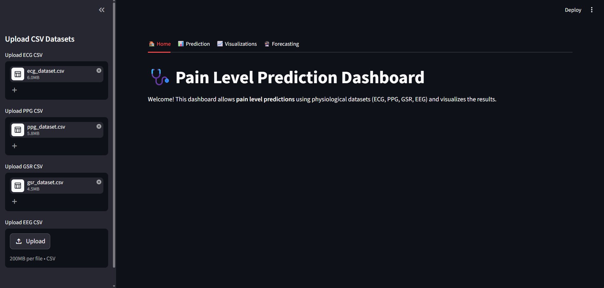
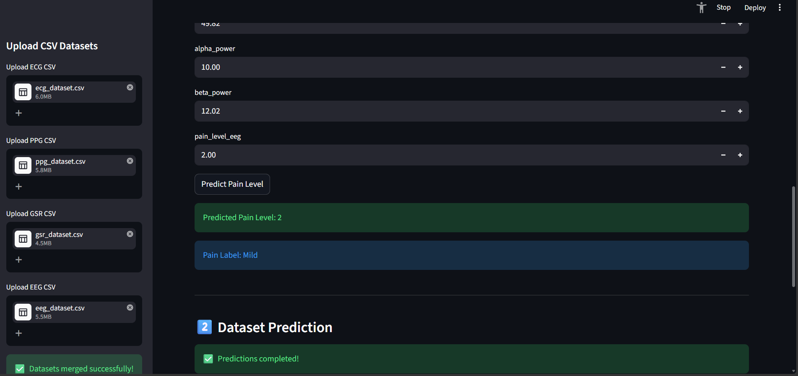
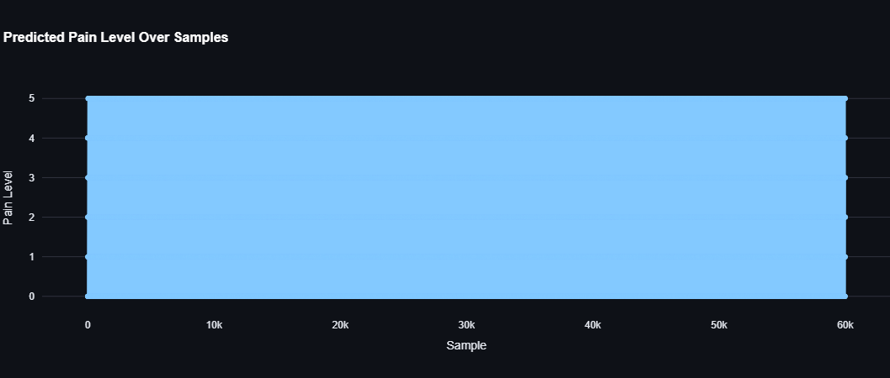
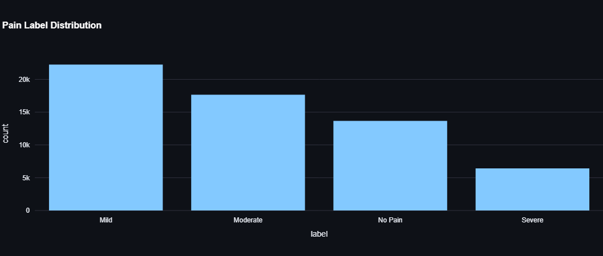
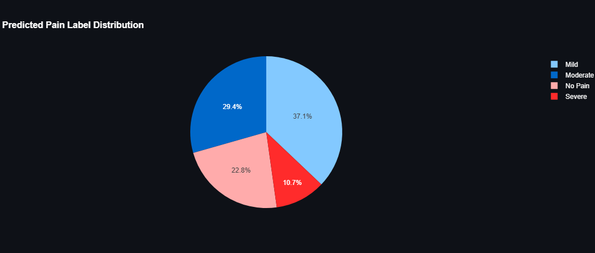
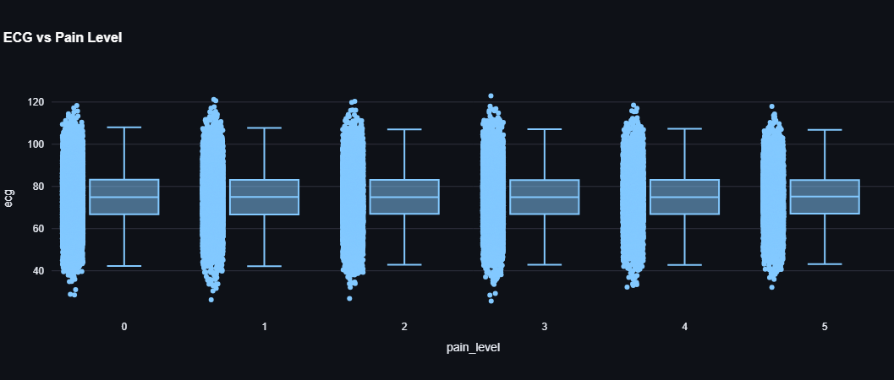
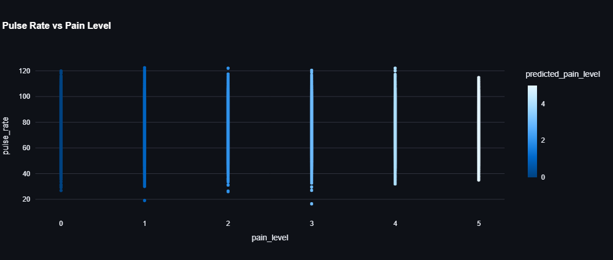
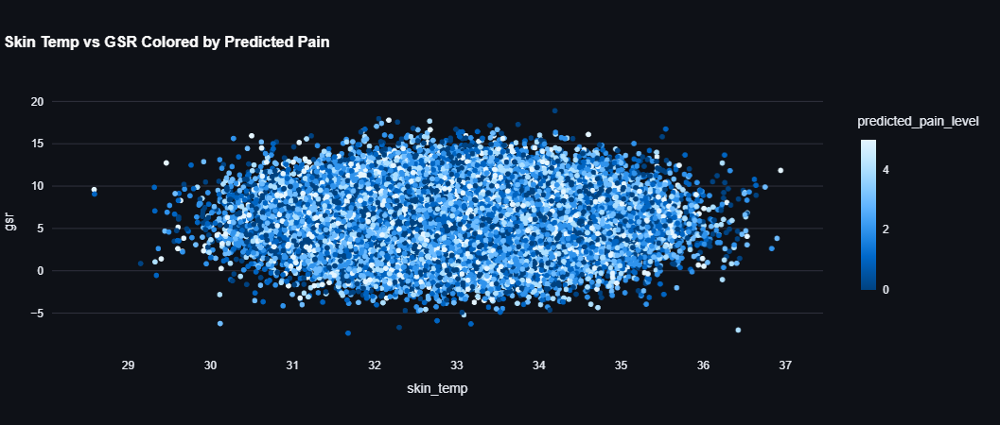
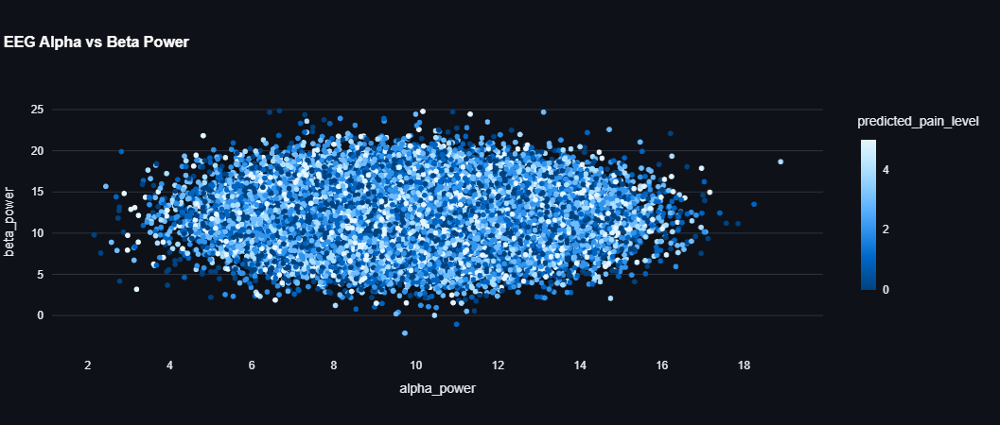
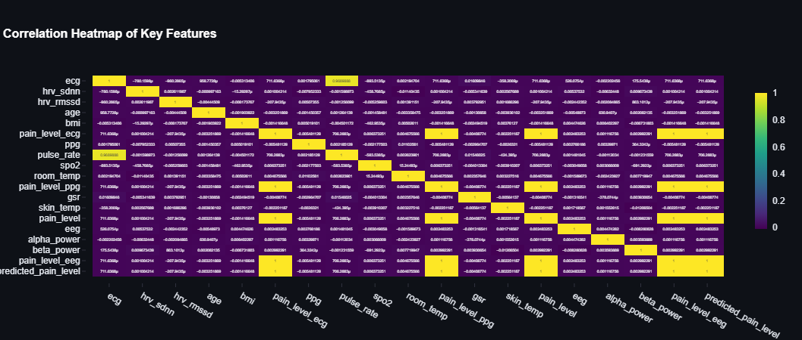

# PAIN-PREDICTION
Predicting pain levels from body signals like ECG, PPG, GSR &amp; EEG  using a CNN-LSTM model. I handled the data pipeline, merged sensor  datasets, and cleaned the data. Built with Python &amp; Streamlit.

app1.py it contains the code

## 📸 Output Screenshots

### 🏠 Home

### 📊 Prediction

### 📈 Visualizations

### 🔮 Forecasting

